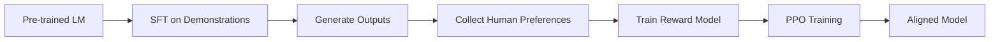

# RLHF & Post-Training Methods: Deep Dive Guide

*Research Date: 2025-08-01*

## Executive Summary

This specialized guide provides in-depth coverage of Reinforcement Learning from Human Feedback (RLHF) and modern post-training methods. It includes practical implementation guides, code examples, and the latest advances beyond traditional RLHF including DPO, SimPO, IPO, and KTO.

### Key Highlights

- Step-by-step RLHF implementation with TRL/TRLx
- Constitutional AI and self-alignment methods
- Cutting-edge preference optimization (SimPO shows 6-7 point improvements)
- Production-ready code examples and best practices

---

## Table of Contents

1. [RLHF Fundamentals](#rlhf-fundamentals)
2. [Implementation Libraries](#implementation-libraries)
3. [Step-by-Step Implementation Guide](#step-by-step-implementation-guide)
4. [Constitutional AI & DPO](#constitutional-ai--dpo)
5. [Beyond RLHF: Modern Methods](#beyond-rlhf-modern-methods)
6. [Code Examples & Tutorials](#code-examples--tutorials)
7. [Research Papers & Theory](#research-papers--theory)
8. [Production Considerations](#production-considerations)

---

## RLHF Fundamentals

### What is RLHF?

RLHF is a technique for training AI systems using human feedback as a reward signal. The process involves:

1. **Supervised Fine-tuning (SFT)**: Initial training on human demonstrations
2. **Reward Model Training**: Learning human preferences from comparisons
3. **RL Optimization**: Using PPO to optimize against the reward model

### The RLHF Pipeline



### Key Resources for Understanding RLHF

#### **CMU RLHF 101 (2025)** ⭐⭐⭐⭐⭐

- **URL**: <https://blog.ml.cmu.edu/2025/06/01/rlhf-101-a-technical-tutorial-on-reinforcement-learning-from-human-feedback/>
- **Why Essential**: Most comprehensive, fully reproducible tutorial
- **Stack**: Llama-3-8B-it + UltraFeedback + Armo reward model

#### **Hugging Face Visual Guide** ⭐⭐⭐⭐⭐

- **URL**: <https://huggingface.co/blog/rlhf>
- **Why Essential**: Best visual explanations of RLHF concepts
- **Time**: 3-4 hours

#### **Nathan Lambert's RLHF Book** ⭐⭐⭐⭐⭐

- **URL**: <https://rlhfbook.com/>
- **Why Essential**: Gentle, comprehensive introduction
- **Coverage**: End-to-end pipeline with practical tips

---

## Implementation Libraries

### TRL (Transformers Reinforcement Learning)

**Installation**:

```bash
pip install trl
# or with all dependencies
pip install trl[peft,quantization,diffusers]
```

**Key Components**:

1. **SFTTrainer**: For supervised fine-tuning

```python
from trl import SFTTrainer, SFTConfig

config = SFTConfig(
    output_dir="./sft_model",
    per_device_train_batch_size=4,
    gradient_accumulation_steps=4,
    learning_rate=2e-5,
    logging_steps=10,
    num_train_epochs=3,
)

trainer = SFTTrainer(
    model=model,
    args=config,
    train_dataset=dataset,
    tokenizer=tokenizer,
)
```

2. **RewardTrainer**: For training reward models

```python
from trl import RewardTrainer, RewardConfig

reward_config = RewardConfig(
    output_dir="./reward_model",
    per_device_train_batch_size=8,
    gradient_accumulation_steps=2,
    learning_rate=1e-5,
)

reward_trainer = RewardTrainer(
    model=reward_model,
    args=reward_config,
    train_dataset=preference_dataset,
    tokenizer=tokenizer,
)
```

3. **PPOTrainer**: For RL fine-tuning

```python
from trl import PPOTrainer, PPOConfig

ppo_config = PPOConfig(
    model_name="gpt2",
    learning_rate=1.41e-5,
    batch_size=256,
    mini_batch_size=16,
    gradient_accumulation_steps=1,
)

ppo_trainer = PPOTrainer(
    model=model,
    ref_model=ref_model,
    tokenizer=tokenizer,
    config=ppo_config,
)
```

### TRLx (Distributed Training)

**When to Use TRLx**:

- Models larger than 7B parameters
- Distributed training requirements
- Need for ILQL algorithm

**Installation**:

```bash
pip install trlx
```

**Basic Configuration**:

```python
import trlx
from trlx.data.default_configs import default_ppo_config

config = default_ppo_config()
config.model.model_path = 'EleutherAI/gpt-j-6b'
config.tokenizer.tokenizer_path = 'EleutherAI/gpt-j-6b'
config.train.batch_size = 32
config.train.total_steps = 10000

trlx.train(
    reward_fn=my_reward_function,
    prompts=training_prompts,
    config=config
)
```

---

## Step-by-Step Implementation Guide

### Phase 1: Data Preparation

#### 1.1 SFT Dataset Format

```python
sft_dataset = [
    {
        "prompt": "What is machine learning?",
        "completion": "Machine learning is a subset of AI that enables systems to learn from data..."
    },
    # More examples...
]
```

#### 1.2 Preference Dataset Format

```python
preference_dataset = [
    {
        "prompt": "Explain quantum computing",
        "chosen": "Quantum computing uses quantum mechanical phenomena...",
        "rejected": "Quantum computing is just really fast computers..."
    },
    # More examples...
]
```

### Phase 2: Supervised Fine-tuning

```python
from transformers import AutoModelForCausalLM, AutoTokenizer
from trl import SFTTrainer, SFTConfig
from datasets import Dataset

# Load model and tokenizer
model = AutoModelForCausalLM.from_pretrained("meta-llama/Llama-2-7b-hf")
tokenizer = AutoTokenizer.from_pretrained("meta-llama/Llama-2-7b-hf")
tokenizer.pad_token = tokenizer.eos_token

# Prepare dataset
def format_sft_sample(example):
    return {
        "text": f"Human: {example['prompt']}\n\nAssistant: {example['completion']}"
    }

dataset = Dataset.from_list(sft_dataset)
dataset = dataset.map(format_sft_sample)

# Train
trainer = SFTTrainer(
    model=model,
    train_dataset=dataset,
    tokenizer=tokenizer,
    args=SFTConfig(
        output_dir="./sft_model",
        max_seq_length=512,
        per_device_train_batch_size=4,
        gradient_accumulation_steps=4,
        warmup_steps=100,
        logging_steps=10,
        save_steps=500,
        learning_rate=2e-5,
        num_train_epochs=3,
    ),
)

trainer.train()
```

### Phase 3: Reward Model Training

```python
from transformers import AutoModelForSequenceClassification
from trl import RewardTrainer, RewardConfig

# Load reward model architecture
reward_model = AutoModelForSequenceClassification.from_pretrained(
    "meta-llama/Llama-2-7b-hf",
    num_labels=1,
)

# Format preference data
def format_preference_sample(example):
    return {
        "input_ids_chosen": tokenizer.encode(example["chosen"]),
        "attention_mask_chosen": [1] * len(tokenizer.encode(example["chosen"])),
        "input_ids_rejected": tokenizer.encode(example["rejected"]),
        "attention_mask_rejected": [1] * len(tokenizer.encode(example["rejected"])),
    }

# Train reward model
reward_trainer = RewardTrainer(
    model=reward_model,
    tokenizer=tokenizer,
    train_dataset=preference_dataset,
    args=RewardConfig(
        output_dir="./reward_model",
        per_device_train_batch_size=8,
        gradient_accumulation_steps=2,
        learning_rate=1e-5,
        num_train_epochs=1,
        report_to="wandb",
    ),
)

reward_trainer.train()
```

### Phase 4: PPO Training

```python
from trl import PPOTrainer, PPOConfig, AutoModelForCausalLMWithValueHead

# Load models
model = AutoModelForCausalLMWithValueHead.from_pretrained("./sft_model")
ref_model = AutoModelForCausalLMWithValueHead.from_pretrained("./sft_model")

# Configure PPO
ppo_config = PPOConfig(
    model_name="llama-7b-sft",
    learning_rate=1.41e-5,
    log_with="wandb",
    batch_size=128,
    mini_batch_size=8,
    gradient_accumulation_steps=2,
    optimize_cuda_cache=True,
    early_stopping=True,
    target_kl=0.1,
    ppo_epochs=4,
    seed=42,
)

# Initialize trainer
ppo_trainer = PPOTrainer(
    model=model,
    ref_model=ref_model,
    tokenizer=tokenizer,
    config=ppo_config,
)

# Training loop
for batch in dataloader:
    queries = batch["query"]
    
    # Generate responses
    response_tensors = ppo_trainer.generate(
        queries,
        max_new_tokens=128,
        do_sample=True,
        temperature=0.7,
    )
    
    # Get rewards from reward model
    rewards = compute_rewards(response_tensors)
    
    # Run PPO update
    stats = ppo_trainer.step(queries, response_tensors, rewards)
    ppo_trainer.log_stats(stats, batch)
```

---

## Constitutional AI & DPO

### Constitutional AI Implementation

Constitutional AI replaces human feedback with AI feedback guided by a constitution:

```python
# Example constitution
CONSTITUTION = [
    "Be helpful and harmless",
    "Avoid generating toxic or biased content",
    "Be honest and acknowledge uncertainty",
    "Respect user privacy",
]

def constitutional_ai_pipeline(model, prompts, constitution):
    # Step 1: Generate initial responses
    responses = model.generate(prompts)
    
    # Step 2: Critique responses using constitution
    critiques = []
    for response, principle in product(responses, constitution):
        critique_prompt = f"""
        Does this response violate the principle: "{principle}"?
        Response: {response}
        Provide specific feedback.
        """
        critiques.append(model.generate(critique_prompt))
    
    # Step 3: Revise based on critiques
    revised_responses = []
    for response, critique in zip(responses, critiques):
        revision_prompt = f"""
        Original: {response}
        Critique: {critique}
        Provide an improved response.
        """
        revised_responses.append(model.generate(revision_prompt))
    
    return revised_responses
```

### Direct Preference Optimization (DPO)

DPO directly optimizes the policy without a separate reward model:

```python
from trl import DPOTrainer, DPOConfig

# Configure DPO
dpo_config = DPOConfig(
    output_dir="./dpo_model",
    per_device_train_batch_size=4,
    gradient_accumulation_steps=4,
    learning_rate=5e-7,
    num_train_epochs=3,
    beta=0.1,  # KL penalty coefficient
    loss_type="sigmoid",  # or "ipo" for IPO loss
)

# Train with DPO
dpo_trainer = DPOTrainer(
    model=model,
    ref_model=ref_model,
    tokenizer=tokenizer,
    train_dataset=preference_dataset,
    args=dpo_config,
)

dpo_trainer.train()
```

---

## Beyond RLHF: Modern Methods

### SimPO (Simple Preference Optimization)

**Key Innovation**: No reference model needed, length-normalized rewards

**Implementation** (using SimPO repository):

```python
# Install SimPO
git clone https://github.com/princeton-nlp/SimPO
cd SimPO

# Configuration for SimPO
simpo_config = {
    "beta": 2.0,  # Higher than DPO
    "simpo_gamma": 1.0,  # Length normalization
    "loss_type": "simpo",
    "no_reference_model": True,
}

# Training script
python train_simpo.py \
    --model_name_or_path meta-llama/Llama-2-7b-hf \
    --dataset_name your_dataset \
    --output_dir ./simpo_model \
    --beta 2.0 \
    --simpo_gamma 1.0 \
    --per_device_train_batch_size 4 \
    --gradient_accumulation_steps 4 \
    --num_train_epochs 3
```

**Performance**: 6-7 point improvement over DPO on AlpacaEval 2

### IPO (Identity Preference Optimization)

**Key Innovation**: Regularization to prevent overfitting

```python
# IPO loss implementation
def ipo_loss(policy_chosen_logps, policy_rejected_logps, beta=0.1, tau=0.5):
    """
    IPO loss with regularization
    tau: regularization strength
    """
    logits_diff = policy_chosen_logps - policy_rejected_logps
    loss = -F.logsigmoid(beta * logits_diff)
    
    # IPO regularization term
    regularization = tau * (policy_chosen_logps**2 + policy_rejected_logps**2).mean()
    
    return loss.mean() + regularization
```

### KTO (Kahneman-Tversky Optimization)

**Key Innovation**: Loss aversion from behavioral economics

```python
# KTO implementation sketch
def kto_loss(policy_logps, labels, beta=0.1, loss_aversion=2.0):
    """
    KTO loss incorporating loss aversion
    loss_aversion: weight for negative examples (typically > 1)
    """
    positive_mask = labels == 1
    negative_mask = labels == 0
    
    # Apply loss aversion to negative examples
    weights = torch.where(negative_mask, loss_aversion, 1.0)
    
    # Compute weighted loss
    loss = -weights * torch.log_softmax(beta * policy_logps, dim=-1)
    
    return loss.mean()
```

---

## Code Examples & Tutorials

### Complete RLHF Implementation Example

Repository structure for a complete RLHF project:

```
rlhf_project/
├── data/
│   ├── prepare_sft_data.py
│   ├── prepare_preference_data.py
│   └── data_utils.py
├── models/
│   ├── sft_training.py
│   ├── reward_model.py
│   └── ppo_training.py
├── configs/
│   ├── sft_config.yaml
│   ├── reward_config.yaml
│   └── ppo_config.yaml
├── evaluation/
│   ├── evaluate_model.py
│   └── human_eval.py
└── main.py
```

### Minimal Working Example

```python
# main.py - Minimal RLHF pipeline
import torch
from transformers import AutoTokenizer, AutoModelForCausalLM
from trl import SFTTrainer, RewardTrainer, PPOTrainer
from trl import SFTConfig, RewardConfig, PPOConfig

def minimal_rlhf_pipeline(base_model_name="gpt2"):
    # Initialize
    tokenizer = AutoTokenizer.from_pretrained(base_model_name)
    tokenizer.pad_token = tokenizer.eos_token
    
    # Step 1: SFT
    print("Step 1: Supervised Fine-tuning")
    sft_model = AutoModelForCausalLM.from_pretrained(base_model_name)
    sft_trainer = SFTTrainer(
        model=sft_model,
        tokenizer=tokenizer,
        train_dataset=load_sft_dataset(),
        args=SFTConfig(output_dir="./sft_model", num_train_epochs=1),
    )
    sft_trainer.train()
    
    # Step 2: Reward Model
    print("Step 2: Training Reward Model")
    reward_model = AutoModelForSequenceClassification.from_pretrained(
        "./sft_model", num_labels=1
    )
    reward_trainer = RewardTrainer(
        model=reward_model,
        tokenizer=tokenizer,
        train_dataset=load_preference_dataset(),
        args=RewardConfig(output_dir="./reward_model", num_train_epochs=1),
    )
    reward_trainer.train()
    
    # Step 3: PPO
    print("Step 3: PPO Training")
    # ... PPO implementation ...
    
    print("RLHF Pipeline Complete!")

if __name__ == "__main__":
    minimal_rlhf_pipeline()
```

---

## Research Papers & Theory

### Essential RLHF Papers

1. **InstructGPT (2022)**
   - ArXiv: <https://arxiv.org/abs/2203.02155>
   - Introduced RLHF for large language models

2. **Constitutional AI (2022)**
   - ArXiv: <https://arxiv.org/abs/2212.08073>
   - Self-improvement without human feedback

3. **Direct Preference Optimization (2023)**
   - ArXiv: <https://arxiv.org/abs/2305.18290>
   - Simplified RLHF without reward models

4. **SimPO (2024)**
   - GitHub: <https://github.com/princeton-nlp/SimPO>
   - Reference-free preference optimization

### Theoretical Foundations

#### Bradley-Terry Model

The foundation of preference learning:

```python
def bradley_terry_probability(reward_a, reward_b):
    """
    Probability that A is preferred over B
    """
    return torch.sigmoid(reward_a - reward_b)
```

#### KL Divergence Constraint

Why we need reference models:

```python
def kl_divergence(log_probs, ref_log_probs):
    """
    KL divergence between policy and reference
    """
    return (log_probs.exp() * (log_probs - ref_log_probs)).sum()
```

---

## Production Considerations

### Scaling Challenges

1. **Memory Requirements**
   - SFT: 1x model size
   - Reward training: 1x model size
   - PPO: 2x model size (policy + reference)
   - Solution: Use LoRA/QLoRA for parameter efficiency

2. **Compute Requirements**
   - PPO typically requires 10-100x more compute than SFT
   - Consider DPO/SimPO for efficiency

3. **Data Quality**
   - Human annotation consistency is crucial
   - Consider Constitutional AI for scale

### Best Practices

1. **Start Small**
   ```python
   # Test pipeline with small model first
   test_model = "gpt2"
   production_model = "meta-llama/Llama-2-7b-hf"
   ```

2. **Monitor Training**
   ```python
   # Key metrics to track
   metrics = {
       "kl_divergence": compute_kl(),
       "reward_mean": rewards.mean(),
       "response_length": response_lengths.mean(),
       "diversity": compute_diversity_metrics(),
   }
   ```

3. **Evaluation Strategy**
   - Automated: Perplexity, reward model scores
   - Human: A/B testing, preference collection
   - Safety: Red teaming, constitutional checks

### Common Pitfalls

1. **Reward Hacking**
   - Model finds ways to maximize reward without being helpful
   - Solution: Diverse training data, KL constraints

2. **Mode Collapse**
   - Model generates repetitive responses
   - Solution: Temperature sampling, diversity bonuses

3. **Catastrophic Forgetting**
   - Model loses pre-training capabilities
   - Solution: Careful learning rates, reference model constraints

---

## Quick Start Recipes

### Recipe 1: Fine-tune Llama 2 with RLHF

```bash
# Install dependencies
pip install transformers trl accelerate bitsandbytes

# Download example script
wget https://raw.githubusercontent.com/huggingface/trl/main/examples/scripts/sft.py

# Run SFT
python sft.py \
    --model_name meta-llama/Llama-2-7b-hf \
    --dataset_name timdettmers/openassistant-guanaco \
    --output_dir ./llama2-sft
```

### Recipe 2: DPO Training

```bash
# Install TRL with DPO support
pip install trl[dpo]

# Run DPO training
python -m trl.scripts.dpo \
    --model_name_or_path ./llama2-sft \
    --tokenizer_name_or_path meta-llama/Llama-2-7b-hf \
    --dataset_name argilla/ultrafeedback-binarized-preferences \
    --output_dir ./llama2-dpo
```

### Recipe 3: Constitutional AI with Small Models

```python
from transformers import pipeline

# Create constitutional AI pipeline
def create_constitutional_pipeline():
    generator = pipeline("text-generation", model="gpt2")
    
    constitution = [
        "Be helpful and honest",
        "Avoid harmful content",
        "Acknowledge uncertainty",
    ]
    
    return ConstitutionalAI(generator, constitution)
```

---

## Resources & Links

### GitHub Repositories

- TRL: <https://github.com/huggingface/trl>
- TRLx: <https://github.com/CarperAI/trlx>
- SimPO: <https://github.com/princeton-nlp/SimPO>
- Constitutional AI: <https://github.com/anthropics/constitutional-ai>

### Tutorials & Courses

- CMU RLHF 101: <https://blog.ml.cmu.edu/2025/06/01/rlhf-101-a-technical-tutorial-on-reinforcement-learning-from-human-feedback/>
- HuggingFace RLHF: <https://huggingface.co/blog/rlhf>
- RLHF Book: <https://rlhfbook.com/>

### Communities

- HuggingFace Forums: <https://discuss.huggingface.co/>
- EleutherAI Discord: <https://discord.gg/eleutherai>
- /r/LocalLLaMA: <https://reddit.com/r/LocalLLaMA>

---

## Conclusion

RLHF and post-training methods are rapidly evolving. This guide provides a foundation for understanding and implementing these techniques. Key takeaways:

1. Start with TRL for standard RLHF implementations
2. Consider DPO/SimPO for efficiency gains
3. Constitutional AI offers scalable alignment
4. Monitor for reward hacking and mode collapse
5. The field is moving quickly - stay updated!

For the latest developments, follow the repositories and communities listed above. Happy training!