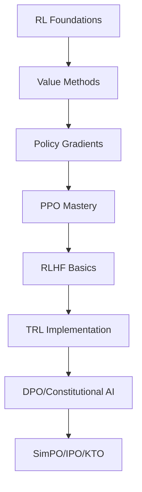

# Enhanced RL Learning Sprint Resources

*Research Date: 2025-08-01*

## Executive Summary

This comprehensive research document enhances your RL foundations sprint with verified direct links and discovers cutting-edge RLHF/post-training resources. The research covers:

- **Verified Sprint Resources**: Direct links to CS234, David Silver's course, and Bertsekas materials
- **RLHF Implementation**: State-of-the-art tutorials and frameworks (TRL, TRLx, Constitutional AI)
- **Beyond RLHF**: Latest preference optimization methods (DPO, SimPO, IPO, KTO)
- **Integration Strategy**: How to bridge RL foundations with RLHF applications

### Key Findings
- All core sprint resources have accessible materials with direct links
- RLHF implementation has matured with production-ready libraries (TRL, TRLx)
- Post-RLHF methods like SimPO show 6-7 point improvements over traditional approaches
- Clear learning path from RL foundations → RLHF → Advanced preference optimization

---

## Part 1: Verified Sprint Resources

### Stanford CS234: Reinforcement Learning

**Status**: ✅ Active (Winter 2025)
**Instructor**: Emma Brunskill
**Access Level**: 🟡 Partial (Some materials require Stanford authentication)

#### Direct Links
- **Course Homepage**: https://web.stanford.edu/class/cs234/index.html
- **Course Modules (Winter 2025)**: https://web.stanford.edu/class/cs234/modules.html
- **Previous Version (Spring 2024)**: https://web.stanford.edu/class/cs234/CS234Spr2024/index.html

#### Available Materials
- ⭐ **Lecture Slides**: Available through course website (post-class versions)
- **Videos**: Canvas/Panopto (requires authentication)
- **Assignments**: Project guidelines and homework available
- **Prerequisites**: Python, Calculus, Linear Algebra, Basic ML

#### Key Topics for Sprint
1. Lecture 1: Introduction to RL
2. Lecture 2: Markov Decision Processes
3. Lecture 3: Planning by Dynamic Programming

**Integration Note**: Perfect foundation for Phase 1 sprint. Pairs well with Sutton & Barto readings.

---

### David Silver's RL Course (DeepMind x UCL)

**Status**: ✅ Fully Accessible
**Year**: 2015 (Still highly relevant)
**Access Level**: 🟢 Free & Open

#### Direct Links
- **Official Course Page**: https://www.davidsilver.uk/teaching/
- **YouTube Playlist**: https://www.youtube.com/playlist?list=PLqYmG7hTraZBKeNJ-JE_eyJHZ7XgBoAyb
- **Slide Collection (GitHub)**: https://github.com/zyxue/youtube_RL_course_by_David_Silver

#### Lecture Breakdown
1. **Lecture 1**: Introduction to Reinforcement Learning
2. **Lecture 2**: Markov Decision Processes ⭐
3. **Lecture 3**: Planning by Dynamic Programming ⭐
4. **Lecture 4**: Model-Free Prediction
5. **Lecture 5**: Model-Free Control
6. **Lecture 6**: Value Function Approximation
7. **Lecture 7**: Policy Gradient Methods
8. **Lecture 8**: Integrating Learning and Planning
9. **Lecture 9**: Exploration and Exploitation
10. **Lecture 10**: Case Study: RL in Classic Games

**Quality**: ⭐⭐⭐⭐⭐ (5/5) - Gold standard for RL foundations
**Time Investment**: ~2 hours per lecture + exercises

---

### Bertsekas Dynamic Programming Materials

**Status**: ✅ Free PDF Available
**Access Level**: 🟢 Free & Open

#### Direct Links
- **"A Course in Reinforcement Learning" (2025, 2nd Edition)**: https://web.mit.edu/dimitrib/www/RLCOURSECOMPLETE.pdf
- **Main RL Book Page**: https://www.mit.edu/~dimitrib/RLbook.html
- **Author's Books Page**: https://www.mit.edu/~dimitrib/books.htm

#### Key Resources
1. **Complete RL Course PDF** (2025): Comprehensive 600+ page textbook
2. **"Reinforcement Learning and Optimal Control"** (2019)
3. **"Rollout, Policy Iteration, and Distributed RL"** (2020)

**Quality**: ⭐⭐⭐⭐⭐ (5/5) - Rigorous mathematical treatment
**Difficulty**: Advanced (Best after basics are solid)
**Time Investment**: 20-30 hours for core chapters

---

### Additional Beginner-Friendly Resources

#### 1. OpenAI Spinning Up
- **URL**: https://spinningup.openai.com/
- **Quality**: ⭐⭐⭐⭐⭐ (5/5)
- **Format**: Tutorial + Code
- **Time**: 10-15 hours
- **Why**: Bridges theory to implementation perfectly

#### 2. Hugging Face Deep RL Course
- **URL**: https://huggingface.co/learn/deep-rl-course/unit0/introduction
- **Quality**: ⭐⭐⭐⭐ (4/5)
- **Format**: Interactive course with hands-on projects
- **Time**: 50+ hours
- **Why**: Modern, practical, uses latest tools

#### 3. The 37 Implementation Details of PPO
- **URL**: https://iclr-blog-track.github.io/2022/03/25/ppo-implementation-details/
- **Quality**: ⭐⭐⭐⭐⭐ (5/5)
- **Format**: Deep-dive blog post
- **Time**: 2-3 hours
- **Why**: Essential for understanding real implementations

---

## Part 2: RLHF & Post-Training Resources

### Core RLHF Tutorials

#### 1. CMU RLHF 101 Technical Tutorial (2025) ⭐⭐⭐⭐⭐
- **URL**: https://blog.ml.cmu.edu/2025/06/01/rlhf-101-a-technical-tutorial-on-reinforcement-learning-from-human-feedback/
- **Quality**: State-of-the-art, fully reproducible
- **Technical Stack**: 
  - UltraFeedback dataset
  - Llama-3-8B-it base model
  - Armo reward model
- **Time Investment**: 15-20 hours
- **Prerequisites**: Strong RL foundations, PyTorch experience

#### 2. Hugging Face RLHF Guide ⭐⭐⭐⭐
- **URL**: https://huggingface.co/blog/rlhf
- **Quality**: Excellent illustrations and explanations
- **Format**: Blog post with code snippets
- **Time Investment**: 3-4 hours
- **Best For**: Visual learners, conceptual understanding

#### 3. Nathan Lambert's RLHF Book ⭐⭐⭐⭐⭐
- **URL**: https://rlhfbook.com/
- **Quality**: Comprehensive, gentle introduction
- **Coverage**: Complete RLHF pipeline from instruction tuning to deployment
- **Time Investment**: 20-30 hours
- **Prerequisites**: Basic ML knowledge

#### 4. Chip Huyen's RLHF Blog ⭐⭐⭐⭐
- **URL**: https://huyenchip.com/2023/05/02/rlhf.html
- **Quality**: Industry perspective, production considerations
- **Time Investment**: 2 hours
- **Best For**: Understanding real-world applications

### RLHF Implementation Libraries

#### 1. TRL (Transformers Reinforcement Learning) ⭐⭐⭐⭐⭐
- **GitHub**: https://github.com/huggingface/trl
- **Documentation**: https://huggingface.co/docs/trl/en/index
- **PyPI**: https://pypi.org/project/trl/

**Features**:
- SFTTrainer, DPOTrainer, PPOTrainer, RewardTrainer
- Full PEFT integration for QLoRA/LoRA
- Scales from single GPU to multi-node via Accelerate
- Active development, production-ready

**Example Usage**:
```python
from transformers import GPT2Tokenizer, GPT2LMHeadModel
from trl import PPOTrainer, PPOConfig

# Initialize PPO trainer
config = PPOConfig(
    model_name="gpt2",
    learning_rate=1e-5,
    batch_size=256,
)
```

#### 2. TRLx (CarperAI) ⭐⭐⭐⭐
- **GitHub**: https://github.com/CarperAI/trlx
- **Focus**: Distributed training for large models (up to 20B parameters)

**Features**:
- Supports PPO and ILQL algorithms
- Handles models like facebook/opt-6.7b, EleutherAI/gpt-neox-20b
- Built for scale and production use

### Constitutional AI & DPO

#### 1. Constitutional AI Resources
- **Anthropic Paper**: https://www.anthropic.com/research/constitutional-ai-harmlessness-from-ai-feedback
- **ArXiv**: https://arxiv.org/abs/2212.08073
- **HuggingFace Implementation**: https://huggingface.co/blog/constitutional_ai

**Key Innovation**: Replaces human feedback with AI feedback guided by principles

#### 2. Direct Preference Optimization (DPO)
- **Key Advantage**: Eliminates reward model, directly optimizes from preferences
- **Performance**: Similar to PPO but simpler and more stable
- **Implementation**: Available in TRL library

### Beyond RLHF: Latest Methods (2024)

#### 1. SimPO (Simple Preference Optimization) ⭐⭐⭐⭐⭐
- **GitHub**: https://github.com/princeton-nlp/SimPO
- **Paper**: NeurIPS 2024
- **Performance**: 6-7 point improvement over DPO on benchmarks

**Key Features**:
- No reference model needed
- Length-normalized reward formulation
- Simpler architecture, less compute

**Available Models**:
- gemma-2-9b-it-SimPO (72.4% AlpacaEval 2 win rate)
- Llama-3-Instruct-8B-SimPO-v0.2

#### 2. IPO (Identity Preference Optimization)
- **Focus**: Enhanced data alignment, overfitting mitigation
- **Method**: Adds regularization to DPO objective
- **Use Case**: When DPO shows overfitting

#### 3. KTO (Kahneman-Tversky Optimization)
- **Theory**: Based on Prospect Theory (loss aversion)
- **Innovation**: Weights rejected samples more heavily
- **Use Case**: When you have more rejection data

### Curated Resource Collections

#### 1. Awesome RLHF (GitHub)
- **URL**: https://github.com/opendilab/awesome-RLHF
- **Quality**: ⭐⭐⭐⭐⭐
- **Description**: Continuously updated list of RLHF papers and implementations

---

## Part 3: Integration Recommendations

### For Current Phase 1 Sprint

#### Week 1-2: Foundations
1. **Primary**: David Silver Lectures 1-3 + Sutton & Barto Ch 1-4
2. **Supplement**: CS234 Lecture slides 1-3
3. **Practice**: OpenAI Spinning Up introductory notebooks
4. **Time**: 20-25 hours

#### Week 3-4: Implementation
1. **Primary**: CleanRL implementations of basic algorithms
2. **Supplement**: Bertsekas PDF (Chapters 1-2 only)
3. **Practice**: Implement tabular Q-learning and policy iteration
4. **Time**: 15-20 hours

### Bridge to RLHF (Phase 5-6)

#### Prerequisites Before RLHF
1. **Complete**: Policy gradient methods (Phase 3)
2. **Understand**: PPO implementation details
3. **Practice**: Train at least one PPO agent successfully

#### RLHF Learning Path
1. **Start**: Hugging Face RLHF blog (conceptual)
2. **Deep Dive**: CMU RLHF 101 Tutorial
3. **Implement**: TRL library tutorials
4. **Advanced**: Constitutional AI → DPO → SimPO

### Recommended Learning Sequence



---

## Part 4: Quality Assessment Summary

### Top-Tier Resources (Must Use)
1. **David Silver's Course**: Complete, free, timeless
2. **CMU RLHF 101**: Most comprehensive RLHF tutorial
3. **TRL Library**: Production-ready implementation
4. **SimPO**: Cutting-edge, better than DPO

### High-Value Supplements
1. **CS234**: Good structure, recent updates
2. **Nathan Lambert's Book**: Gentle RLHF introduction
3. **Bertsekas PDF**: Mathematical rigor
4. **Constitutional AI**: Important paradigm shift

### Time-Efficient Options
1. **Hugging Face Blogs**: 2-4 hours each, high impact
2. **37 PPO Details**: Essential for implementation
3. **Chip Huyen's RLHF**: Industry perspective

### For Different Learning Styles
- **Visual**: Hugging Face illustrations, Jay Alammar's blog
- **Hands-on**: TRL tutorials, CleanRL implementations  
- **Theoretical**: Bertsekas, research papers
- **Practical**: OpenAI Spinning Up, HF Deep RL Course

---

## Actionable Next Steps

### Immediate Actions (This Week)
1. ✅ Bookmark David Silver's YouTube playlist
2. ✅ Download Bertsekas PDF for reference
3. ✅ Set up TRL library in your environment
4. ✅ Read Hugging Face RLHF blog (3 hours)

### Sprint Integration
1. Add SimPO paper to Phase 6 reading list
2. Plan TRL implementation project for Phase 5
3. Schedule CMU tutorial for RLHF deep dive
4. Prepare compute resources for model training

### Resource Management
1. Create RLHF_Resources subfolder
2. Download key PDFs for offline access
3. Star GitHub repositories for tracking
4. Set up experiment tracking (W&B/TensorBoard)

---

## Updates & Maintenance

This research document should be updated when:
- New RLHF methods emerge (check quarterly)
- Course materials update (check each semester)
- Libraries release major versions
- Better tutorials become available

Last comprehensive update: 2025-08-01

---

## Quick Reference Links

### RL Foundations
- [David Silver YouTube](https://www.youtube.com/playlist?list=PLqYmG7hTraZBKeNJ-JE_eyJHZ7XgBoAyb)
- [CS234 Winter 2025](https://web.stanford.edu/class/cs234/modules.html)
- [Bertsekas RL PDF](https://web.mit.edu/dimitrib/www/RLCOURSECOMPLETE.pdf)
- [OpenAI Spinning Up](https://spinningup.openai.com/)

### RLHF Implementation
- [CMU RLHF 101](https://blog.ml.cmu.edu/2025/06/01/rlhf-101-a-technical-tutorial-on-reinforcement-learning-from-human-feedback/)
- [TRL Documentation](https://huggingface.co/docs/trl/en/index)
- [TRLx GitHub](https://github.com/CarperAI/trlx)
- [RLHF Book](https://rlhfbook.com/)

### Beyond RLHF
- [SimPO GitHub](https://github.com/princeton-nlp/SimPO)
- [Constitutional AI](https://huggingface.co/blog/constitutional_ai)
- [Awesome RLHF](https://github.com/opendilab/awesome-RLHF)

### Communities
- [HuggingFace Discord](https://discord.gg/huggingface)
- [r/reinforcementlearning](https://www.reddit.com/r/reinforcementlearning/)
- [Eleuther AI Discord](https://discord.gg/eleutherai)